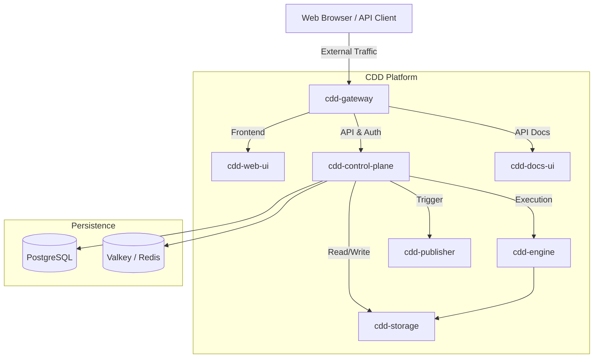
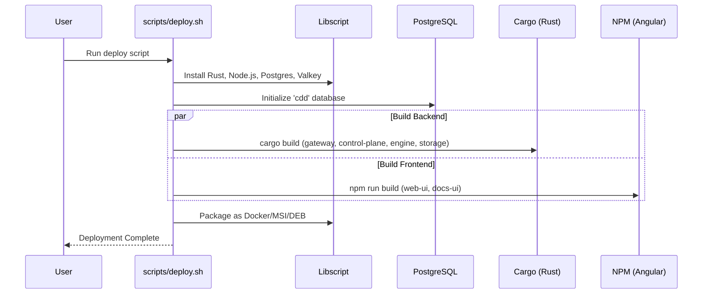

CDD Platform Operations (cdd-ops)
=================================
[](https://opensource.org/licenses/Apache-2.0)
[](https://github.com/SamuelMarks/cdd-ops/actions)

This repository contains the infrastructure, orchestration, and deployment configurations for the Compiler Driven Development (CDD) ecosystem.

## Overview

The `cdd-ops` repository serves as the central hub for managing the CDD microservices architecture. It provides the tools and configurations necessary to stand up the entire platform locally for development, package it for distribution, or deploy it to a production Kubernetes cluster.

### System Architecture

The following diagram illustrates the high-level architecture and traffic flow between the CDD microservices:



## Repository Structure

- `docker/`: Docker Compose configurations for local development and testing.
- `kubernetes/`: Helm charts, Kustomize configurations, and deployment guides for Kubernetes.
- `scripts/`: Shell and batch scripts for automating common deployment and operational tasks.
- `e2e/`: End-to-End (E2E) testing framework utilizing Playwright.
- `docs/`: Additional documentation and guides.

## Deployment Options

There are several ways to deploy and run the CDD ecosystem, ranging from automated local builds to production-grade Kubernetes deployments.

### 1. Automated Local Deployment (Build from Source)

The provided deployment scripts (`scripts/deploy.sh` for Linux/macOS and `scripts/deploy.cmd` for Windows) automate the process of setting up a local development environment by building all microservices from their respective source repositories.



The script performs the following operations:
- **Dependency Provisioning:** Uses `libscript` (with `mise` as the node manager) to install core dependencies like Rust, Node.js, PostgreSQL, and Valkey/Redis.
- **Database Setup:** Automatically initializes the `cdd` PostgreSQL database.
- **Service Compilation:** Iterates through all adjacent `cdd-*` repositories (e.g., `cdd-gateway`, `cdd-web-ui`, `cdd-control-plane`, `cdd-engine`, `cdd-storage`, `cdd-publisher`, `cdd-docs-ui`) and builds them in-place using `cargo` or `npm`.
- **Infrastructure Packaging:** Exports the infrastructure into various formats:
  - `docker` / `docker-compose`
  - Installer executables (`msi`, `exe`)
  - Debian packages (`deb`)

**Usage:**
```bash
./scripts/deploy.sh
# or on Windows:
.\scripts\deploy.cmd
```

### 2. Docker Compose (Containerized Local Development)

For a streamlined local experience without building from source manually, you can use the pre-configured Docker Compose setup.

**Usage:**
```bash
cd docker
docker-compose up -d
```
For more details, see the [Docker Compose Guide](docker/README.md).

### 3. Kubernetes (Production Deployment)

For production deployments, `cdd-ops` provides Helm charts and Kustomize manifests to deploy the CDD platform to a Kubernetes cluster.

Please refer to the detailed [Kubernetes Guide](kubernetes/README.md) for configuration and deployment instructions.

### 4. Native Deployment (Bare Metal & OS Packages)

For environments where containerization (Docker/Kubernetes) is not preferred or available, the CDD ecosystem can be deployed natively on bare metal servers or virtual machines using standard OS-level package managers.

The `scripts/deploy.sh` (or `scripts/deploy.cmd`) system utilizes `libscript` to generate native installers.

**Available Package Formats:**
*   **Debian/Ubuntu (`.deb`):** Deploys the Rust binaries, configures `systemd` services, and sets up Nginx as the gateway.
*   **Windows Installer (`.msi` / `.exe`):** Installs the services as Windows Background Services.
*   **macOS (`.pkg`):** Installs the binaries and configures `launchd` daemons for background execution.

**Benefits of Native Deployment:**
*   **Lower Overhead:** Direct access to host resources without container virtualization overhead.
*   **System Integration:** Deep integration with OS-native tooling like `journalctl` for logs, `systemctl` for service management, and native firewall tools.
*   **Performance:** Maximum disk and network I/O performance, which is highly beneficial for heavy `cdd-engine` code generation workloads.

**Typical Native Architecture:**
1.  **Reverse Proxy:** `nginx` or `haproxy` installed via system packages (`apt`/`brew`), configured to replace `cdd-gateway`.
2.  **Databases:** PostgreSQL and Valkey/Redis installed natively via system packages.
3.  **CDD Services:** Installed via `.deb` or `.msi`. Each service (`cdd-control-plane`, `cdd-engine`, etc.) runs as a dedicated system user (e.g., `cdd-user`) with a corresponding OS service file ensuring automatic restarts and proper privilege isolation.

To generate the native packages, run the build script with the native packaging flags:
```bash
# Example: Build a Debian package
./scripts/deploy.sh --target deb
```

## Testing

The platform utilizes a comprehensive End-to-End (E2E) testing suite based on [Playwright](https://playwright.dev/).

The testing automation is handled by `scripts/test.sh` (or `scripts/test.cmd` on Windows), which ensures the environment is correctly provisioned before running the tests. 

The test script performs the following:
- Provisions required dependencies (Rust, Node.js, PostgreSQL, Valkey/Redis) via `libscript`.
- Prepares the PostgreSQL database for testing.
- Installs NPM dependencies for the E2E framework.
- Executes the Playwright test suite against the local deployment (`http://localhost`).

**Running the Tests:**
```bash
./scripts/test.sh
# or on Windows:
.\scripts\test.cmd
```

The test definitions and Playwright configuration can be found in the `e2e/` directory.

## Further Reading

- [Architecture Overview](ARCHITECTURE.md)
- [Libscript Guide](docs/libscript.md)

---

## Dependencies

| Name | Description | CI |
| ---- | ----------- | -- |
| [cdd-c](https://github.com/SamuelMarks/cdd-c) | OpenAPI ↔ C. Frontend for C, concentrating on: generation from code; single-file analysis; modification; and emission (prettyprinting). | [](https://github.com/SamuelMarks/cdd-c/actions) |
| [cdd-cpp](https://github.com/SamuelMarks/cdd-cpp) | OpenAPI ↔ C++ | [](https://github.com/SamuelMarks/cdd-cpp/actions) |
| [cdd-csharp](https://github.com/SamuelMarks/cdd-csharp) | OpenAPI ↔ C# | [](https://github.com/SamuelMarks/cdd-csharp/actions) |
| [cdd-go](https://github.com/SamuelMarks/cdd-go) | OpenAPI ↔ Go | [](https://github.com/SamuelMarks/cdd-go/actions) |
| [cdd-java](https://github.com/SamuelMarks/cdd-java) | OpenAPI ↔ Java | [](https://github.com/SamuelMarks/cdd-java/actions) |
| [cdd-kotlin](https://github.com/SamuelMarks/cdd-kotlin) | OpenAPI ↔ Kotlin: Compiler Driven Development for Kotlin. | [](https://github.com/SamuelMarks/cdd-kotlin/actions) |
| [cdd-php](https://github.com/SamuelMarks/cdd-php) | OpenAPI ↔ PHP | [](https://github.com/SamuelMarks/cdd-php/actions) |
| [cdd-python-all](https://github.com/offscale/cdd-python-all) | OpenAPI ↔ Python | [](https://github.com/offscale/cdd-python-all/actions) |
| [cdd-ruby](https://github.com/SamuelMarks/cdd-ruby) | OpenAPI ↔ Ruby | [](https://github.com/SamuelMarks/cdd-ruby/actions) |
| [cdd-rust](https://github.com/SamuelMarks/cdd-rust) | OpenAPI ↔ Rust (actix, diesel) | [](https://github.com/SamuelMarks/cdd-rust/actions) |
| [cdd-sh](https://github.com/SamuelMarks/cdd-sh) | OpenAPI ↔ /bin/sh (client, `curl` & `jq`) | [](https://github.com/SamuelMarks/cdd-sh/actions) |
| [cdd-swift](https://github.com/SamuelMarks/cdd-swift) | OpenAPI ↔ Swift | [](https://github.com/SamuelMarks/cdd-swift/actions) |
| [cdd-ts](https://github.com/offscale/cdd-ts) | OpenAPI ↔ TypeScript | [](https://github.com/offscale/cdd-ts/actions) |
| [cdd-control-plane](https://github.com/SamuelMarks/cdd-control-plane) | CDD Control Plane service | [](https://github.com/SamuelMarks/cdd-control-plane/actions) |
| [cdd-docs-ui](https://github.com/SamuelMarks/cdd-docs-ui) | API docs UI for OpenAPI produced by CDD-* ecosystem CLIs | [](https://github.com/SamuelMarks/cdd-docs-ui/actions) |
| [cdd-engine](https://github.com/SamuelMarks/cdd-engine) | The core execution engine for the cdd-* toolchain. | [](https://github.com/SamuelMarks/cdd-engine/actions) |
| [cdd-gateway](https://github.com/SamuelMarks/cdd-gateway) | API Gateway and management plane for the cdd-* toolchain. | [](https://github.com/SamuelMarks/cdd-gateway/actions) |
| [cdd-openapi-test-harness](https://github.com/SamuelMarks/cdd-openapi-test-harness) | OpenAPI shared test harness for Compiler Driven Development (CDD) | [](https://github.com/SamuelMarks/cdd-openapi-test-harness/actions) |
| [cdd-ops](https://github.com/SamuelMarks/cdd-ops) | Deploy and test cdd-* suite + web + APIs + databases | [](https://github.com/SamuelMarks/cdd-ops/actions) |
| [cdd-publisher](https://github.com/SamuelMarks/cdd-publisher) | CDD Publisher service | [](https://github.com/SamuelMarks/cdd-publisher/actions) |
| [cdd-storage](https://github.com/SamuelMarks/cdd-storage) | CDD Storage service | [](https://github.com/SamuelMarks/cdd-storage/actions) |
| [cdd-web-ui](https://github.com/SamuelMarks/cdd-web-ui) | CDD (OpenAPI ↔ lang) unified into project-oriented web dashboards | [](https://github.com/SamuelMarks/cdd-web-ui/actions) |

## License

Licensed under either of

- Apache License, Version 2.0 ([LICENSE-APACHE](LICENSE-APACHE) or <https://www.apache.org/licenses/LICENSE-2.0>)
- MIT license ([LICENSE-MIT](LICENSE-MIT) or <https://opensource.org/licenses/MIT>)

at your option.

### Contribution

Unless you explicitly state otherwise, any contribution intentionally submitted
for inclusion in the work by you, as defined in the Apache-2.0 license, shall be
dual licensed as above, without any additional terms or conditions.
